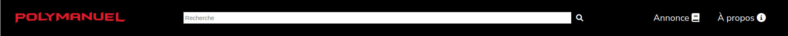

# TP1

Le but de ce travail pratique est de vous familiariser avec les langages **HTML** et **CSS**. Vous allez élaborer la structure de pages web en utilisant HTML, mettre en place l’interaction entre les différentes pages à l’aide des hyperliens et vous aurez à reproduire les maquettes fournies des différentes pages du site. Vous pourrez aussi vous familiariser avec l’exécution de test automatisés avec la librairie **Cypress**.

## Installation des librairies nécessaires

Vous aurez besoin de l'environnement d'exécution `NodeJS` et son gestionnaire de paquet `npm`. Vous pouvez les installer sur votre machine à partir du [lien suivant](https://nodejs.org/en/download/). On vous recommande d'installer la version *LTS*.

Pour installer les dépendances nécessaires, lancez la commande `npm ci` dans le répertoire `site-web`. Ceci installera toutes les librairies définies (`http-server` et `cypress` ) dans le fichier `package.json` avec les versions exactes définies dans `package-lock.json`.

## Exécution des tests

Consultez le fichier [TESTS.MD](./TESTS.MD) pour une description détaillée de l'outil Cypress et le fonctionnement des tests.

**Note** : commencez par les tests de `intro.cy.js` qui ne valident que le HTML/CSS de l'élément `<footer>`. Initialement, les tests pour le bas de page vont échouer puisque leur code n'est pas complet. On vous recommande **fortement** de commencer par compléter cette partie du TP en premier en utilisant les tests comme guide. Lisez bien le code dans [`shared.js`](./site-web/cypress/e2e/shared.js) pour mieux comprendre le résultat attendu.

## Déploiement local

Vous pouvez faire un déploiement local de votre site avec l'outil `http-server`. Si vous lancez la commande `npm start` dans le répertoire `site-web`, un serveur HTTP statique sera déployé sur votre machine et votre site sera accessible sur l'adresse `localhost:3000` ou `<votre-adresse-IP>:3000`. La sortie dans le terminal vous donnera l'adresse exacte d'accès.

## Description du travail

## Règles CSS

Votre travail utilisera un mélange de règles CSS internes (faites par vous) et externes. La police `Nunito Sans` de Google vous est déjà fournie dans le code de départ.

Vous allez utiliser la librairie `FontAwesome` pour les icônes dans vos pages. Pour ajouter une icône, il faut donner la classe `fa` à un élément et ajouter une classe spécifique pour l'icône désirée. Par exemple : `fa fa-book` pour l'icône de la page `add`. Les liens pour la libraire `FontAwesome` sont déjà ajoutés dans le fichier `about.html`.

Le reste du code CSS à compléter par vous se trouve dans les fichiers `css` fournis. Le fichier [shared.css](./site-web/src/assets/css/shared.css) devra contenir les règles communes à toutes les pages. Les autres fichiers CSS contiendront les règles spécifiques à chaque page. Attention au fichiers référencés dans les différentes pages HTML. 

Quelques règles et sélecteurs vous sont fournis pour vous aider à débuter le travail.

### Thème visuel du site

Le fichier `shared.css` contient quelques variables CSS avec des valeurs prédéfinies pour les couleurs principales du site. Les captures d'écran fournies utilisent ces couleurs. Basez-vous sur les noms fournis pour comprendre leur rôle. Vous êtes libres de changer les couleurs si vous le voulez, mais ceci ne devrait pas affecter la lisibilité du site.

## Entête et bas de page

Pour la suite de ce travail pratique, vous devez d’abord élaborer la structure des pages HTML qui composeront votre site web. Cette structure devra être définie à l’aide des balises sémantiques de HTML telles que les balises `<header>`, `<nav>`, `<main>` et `<footer>`. Les sous-sections qui suivent décrivent les différentes pages à réaliser.

### Entête

L'entête contient 3 sections distinctes alignées à gauche, au centre et à droite respectivement. Toutes les pages partagent le même entête sauf pour la page principale, `index` qui contient une barre de recherche au centre.

    

#### Première section

Contient le logo du site d'une largeur fixe de votre choix qui redirige vers la page principale.

#### Deuxième section

Contient une barre de recherche composée d'un champ de saisie avec une valeur temporaire et un bouton de recherche (`fa-search` de *FontAwesome*). Le bouton doit transformer le curseur en pointeur lorsque survolé par la souris. La barre de recherche doit être un formulaire de type `GET`.

Cette section est vide sur toutes les pages sauf pour la page `index`.

Référez-vous aux tests dans le fichier [index.cy.js](./site-web/cypress/e2e/index.cy.js) pour les identifiants à utiliser pour les éléments de la barre de recherche.

#### Troisième section

Contient des liens vers les pages `add.html` et `about.html` accompagnées d'une icône. Les icônes utilisées dans les captures sont `fa-book` et `fa-circle-info`. 

Lorsqu'un utilisateur passe sa souris par-dessus l'un des éléments de la barre de navigation, l'élément devrait être souligné.

    

Lorsque la page `add.html` ou `about.html` est sélectionnée, l'élément qui correspond au nom de la page dans la barre de navigation doit être en gras avec une couleur prédéfinie. Ce n'est pas le cas pour `index.html` ou `item.html`.

    

### Bas de page

Cette section doit toujours être placée en bas de la page, occuper la totalité de sa largeur et être de la couleur de fond principale du site. Le bas de page est le même pour toutes les pages du site.

La section contient le nom et matricule de chaque membre de l'équipe alignés à droite avec un identifiant unique. Référez-vous aux tests dans le fichier [shared.cy.js](./site-web/cypress/e2e/shared.js) pour les identifiants à utiliser.

## Page À Propos (about.html)

La page `about.html` devrait être similaire à celle-ci. Le code HTML et CSS du contenu principal vous est déjà fourni pour vous aider à débuter votre TP. Vous pouvez utiliser cette page pour vérifier le thème visuel de votre site. La couleur de fond du contenu principal doit être différente de la couleur de fond de l'entête et le bas de page.

    

## Page Principale (index.html)

Consultez le fichier [data.json](./site-web/src/assets/data.json) pour les informations détaillées des manuels. Vous pouvez utiliser le même ordre que dans la capture d'écran plus bas.

Le contenu principal de la page est centré dans un conteneur d'une largeur maximale de `1500px`. La couleur de fond du contenu principal doit être la même que l'entête et le bas de page.

Les manuels sont affichés dans une liste avec une vignette de taille uniforme de **475px x 475px**. Elles sont espacées de manière uniforme et si l'espace horizontal est insuffisant, les prochaines vignettes doivent être placées sur les lignes suivantes.

Chaque vignette contient le titre du manuel, une image et son prix, centrés horizontallement. L'image doit occuper 80% de l'hauteur de la vignette. Un clic sur la vignette doit rediriger l'utilisateur vers la page `item.html`.

Référez-vous aux tests dans le fichier [index.cy.js](./site-web/cypress/e2e/index.cy.js) pour les identifiants et classes à utiliser pour les différents éléments HTML.

Voici un exemple de la page principale avec un survol de la souris sur le deuixème manuel :

    

### Effets de survol

Lorsqu'un utilisateur passe sa souris par-dessus une vignette, 2 actions différentes devrait se produire :

1. L'image de la vignette devrait graduellement (en espace de 0.5s) grossir de **10%**. _Astuce : les propriétés [transform](https://developer.mozilla.org/en-US/docs/Web/CSS/transform) et [transition](https://developer.mozilla.org/en-US/docs/Web/CSS/transition) vous seront utiles pour cet effet._ 

2. Une pastille de couleur prédéfinie devrait apparaître en bas à droite de la vignette. La pastille doit reflèter l'état (`Nouveau` ou `Usagé`) du manuel. Utilisez l'attribut `status` dans `data.json` et les variables CSS dans `shared.css` pour déterminer la couleur de la pastille.

Consultez la capture d'écran plus haut pour un exemple de ces effets.

### Effets de réduction de la largeur de l'écran

Lorsqu'un utilisateur réduit la largeur de l'écran sous une certaine taille, le visuel de la page principale doit changer. Voici les 2 seuils à considérer :

1. **800px** :  la barre de recherche est cachée. Les vignettes sont placées en une seule ligne verticale et centrés horizontalement. La taille de la police de l'entête est également réduite.

2. **500px** : l'image de chaque vignette est cachée : seuls le titre et le prix sont affichés. La taille du logo est également réduite.

Le comportement des vignettes devrait être le même, peu importe la largeur.

Voici un exemple de la page principale à une largeur de **1000px** vs **750px** :

    
    

Voici le visuel de la page à une largeur de **475px** :

    

## Page Détails (item.html)

Cette page est accessible à travers un clic sur une des affiches de la page principale. Le contenu de la page est toujours le même et basé sur le premier élément du fichier `data.json`.

Le visuel de la page `item.html` devrait être similaire à celui-ci : 

    

Le contenu principal de la page est centré et divisé en 3 sections : l'image du manuel (gauche), sa description (en haut à droite) et un formulaire de contact (en bas à droite). Le nom de l'item est placé en haut de ces sections.

Le conteneur de l'image est d'une taille fixe de **600px x 600px**. Pour des images de taille différente, l'attribut CSS `object-fit` permet de les ajuster à la taille de la boîte.
Les éléments de la descriptions sont alignées à gauche et à droite de leur section tel qu'illustré dans la capture d'écran.

**Note** : vous **devez** utiliser une grille (_grid_) CSS pour la mise en place des éléments de ces 3 sections. Vous êtes libres d'utiliser des boîtes flexibles (_flexbox_) ou des grilles pour les éléments internes de chaque section, si vous le désirez.

Référez-vous aux tests dans le fichier [item.cy.js](./site-web/cypress/e2e/item.cy.js) pour les identifiants et classes à utiliser pour les différents éléments HTML.

### Formulaire de contact

Le formulaire contient deux champs qui obligatoires : le nom et le message ainsi qu'un bouton d'envoi. Contrairement à la barre de recherche, la méthode de soumission du formulaire est de type `POST`.

Le champ de nom ne doit pas accepter des espaces ("`    `") comme une entrée valide.

Le champ de message est une boîte de texte riche `<textarea>` avec un texte temporaire (_placeholder_). Elle doit être redimensionnable seulement horizontalement. Sa taille horizontale ne peut pas dépasser l'intervalle de **100px** à **600px**. Sa taille verticale est fixe et laissée à votre discrétion.

Le bouton d'envoi est aligné à droite, peu importe la taille horizontale du formulaire.

## Page d'Annonce (add.html)

Cette page contient un formulaire pour l'ajout d'une nouvelle annonce. Le visuel est le suivant :

    

Le formulaire est composé de deux parties avec des informations différentes. Chaque information doit être accompagnée d'une étiquette appropriée. Les étiquettes sont alignées à gauche et les champs à droite.

La première partie contient les informations générales de l'annonce : le titre, le prix, une image et l'état du manuel. Le prix ne peut pas être négatif et une valeur par défaut est suggérée au chargement initial de la page. L'état du manuel est un menu déroulant avec deux options : `Nouveau` et `Usagé`. Pour les images, seulement un fichier de type `image/` est accepté.

**Note** : un `<input type="file">` est limité au niveau des changements CSS. Vous pouvez utiliser `direction : rtl` pour inverser la direction du texte pour un meilleur visuel. La capture d'écran n'utilise pas cette approche.

La deuxième partie contient les informations de contact : le nom, le courriel et une option de cacher le nom du vendeur dans l'annonce publiée. Le courriel doit être valide et le nom ne doit pas accepter des espaces ("`    `") comme une entrée valide.

L'état du manuel et l'option d'anonymat sont les seules informations facultatives pour la soumission d'un formulaire. Le bouton de soumission doit avoir le même visuel que le bouton de la page `item.html`.

**Note** : ce formulaire contient un fichier. L'attribut `enctype` doit donc avoir une valeur spécifique différente de la valeur par défaut.

Référez-vous aux tests dans le fichier [add.cy.js](./site-web/cypress/e2e/add.cy.js) pour les identifiants et classes à utiliser pour les différents éléments HTML.

# Fonctionnalité bonus

Dans la version de base, le formulaire de contact de la page `item.html` ne fait que valider les champs obligatoires. Pour la fonctionnalité bonus, vous devez ajouter une validation supplémentaire pour le champ de message. Le message doit contenir moins de **50 caractères** non-vides et au moins **5 mots** pour être valide. Un mot est défini comme une suite de caractères séparés par un espace.

Si le message est invalide, un message d'erreur expliquant la raison doit être affiché en dessous du champ de message.

Vous devez implémenter la validation de champ en utilisant JavaScript. Consultez l'exemple du cours pour la validation d'un champ de formulaire pour vous aider.

Vous devez également implémenter des tests pour cette fonctionnalité. Quelques tests de base sont déjà fournis dans le fichier [bonus.cy.js](./site-web/cypress/e2e/bonus.cy.js). Vous devez ajouter la logique des autres tests nécessaires pour valider la fonctionnalité.

# Correction et remise

La grille de correction détaillée est disponible dans [CORRECTION.MD](./CORRECTION.MD). L'ensemble des tests fournis doit réussir lors de votre remise.

Le travail doit être remis au plus tard le vendredi 27 septembre à 23:59 sur l'entrepôt Git de votre équipe. Le nom de votre entrepôt Git doit avoir le nom suivant : `tp1-matricule1-matricule2` avec les matricules des 2 membres de l’équipe.

**Aucun retard ne sera accepté** pour la remise. En cas de retard, la note sera de 0.