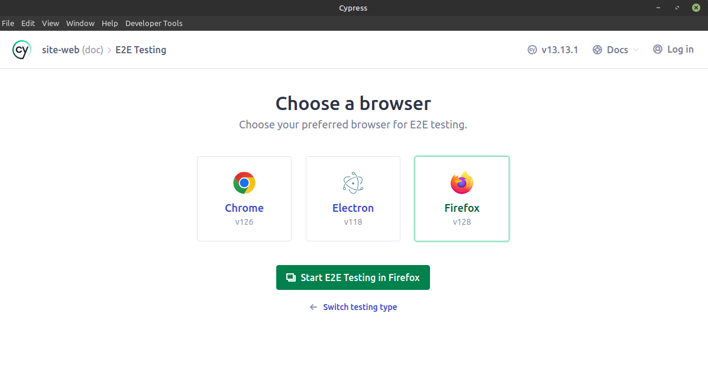
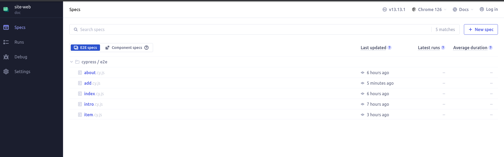
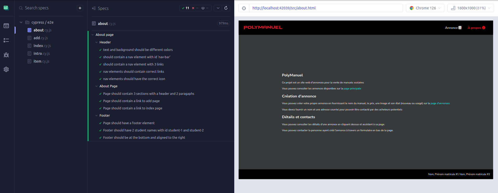
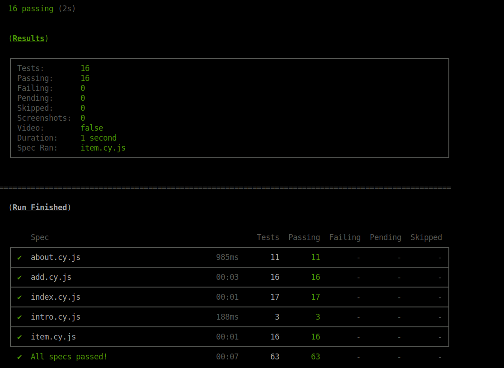

## Exécution des tests 

Vous pouvez exécuter les tests automatisés avec la commande `npm run test`. Ceci lancera l'outil Cypress pour l'exécution des tests dans le fureteur de votre choix.

La commande `npm run test:headless` exécute tous les tests dans un terminal sans ouvrir un fureteur dédié.

## Introduction à Cypress

La bibliothèque <a href="https://www.cypress.io/">Cypress</a> sera utilisée dans ce travail pratique. Cypress est un outil de tests automatisés pour les applications web. Il permet de tester les applications web en simulant les actions de l'utilisateur directement sur une page web. 

Son interface graphique permet de choisir l'environnement de test et de visualiser les résultats des tests. Un lancement initial avec la commande `npm run test` devrait ouvrir une fenêtre semblable à celle-ci:

    

Dans votre cas, vous voulez effectuer des tests de validation pour les éléments HTML et des tests de bout en bout `E2E (End to End)` pour certaines actions de l'utilisateur, tels que la soumission des formulaires ou la navigation des liens entre les pages.

Vous pouvez cliquer sur l'option `E2E Testing`. Une nouvelle fenêtre devrait apparaître avec plusieurs options de navigateurs. Notez que certaines fonctionnalités peuvent ne pas être disponibles dans tous les navigateurs. Le code fourni a été testé dans Chrome et Firefox.

Vous devriez maintenant voir une fenêtre contenant les différents fichiers de tests: `about`, `add`, `index`, `item` et `intro`. Lorsque vous cliquez sur l'un des fichiers, l'ensemble des tests de ce fichier sera exécuté.

    

Voici un exemple des tests de la page `About` définis dans `about.cy.js`. Notez que les tests de l'entête et bas de page sont également exécutés.

    

Dans votre cas, certains tests devraient échouer initialement comme rien n'est encore implémenté. Votre travail sera donc d'implémenter le code qui va permettre d'exécuter l'ensemble des tests pour que ceux-ci passent avec succès. 

Commencez par l'implémentation de l'entête et bas de page. Un ensemble de tests pour ces parties est disponible dans `intro.cy.js`. Ces mêmes tests seront exécutés pour chaque page. La page `index` contient des tests supplémentaires pour la barre de recherche.

Chaque test est un ensemble d'instructions qui simulent les actions de l'utilisateur. Vous pouvez cliquer sur le nom d'un test, voir ses étapes et même la différence visuelle entre les étapes si la page est manipulée. Par exemple, les tests de la page `item` et `add` remplissent les formulaires présents.

### Mode `headless`

Si vous ne souhaitez pas avoir d'interface graphique, vous pouvez aussi utiliser `npm run test:headless`. Les mêmes tests seront exécutés dans le terminal.

**Note** : cette commande exécute les tests de tous les fichiers `*.cy.js`. Si vous voulez exécuter un fichier spécifique, vous pouvez utiliser la commande `npm run test:headless -- --spec "cypress/e2e/<nom-du-fichier>.cy.js"`. 

Vous devriez voir, en exécutant la commande, l'ensemble des tests exécutés dans le terminal. Vous devriez aussi pouvoir constater le résultat de vos tests.

    

## Remise du travail

À la remise du travail pratique, l'ensemble des tests fournis devraient réussir.

Les tests ont une certaine flexibilité. Il est donc possible que le visuel de votre TP ne soit pas exactement pareil aux exemples donnés. Vous pouvez, par exemple, changer les couleurs présentes dans les différentes variables CSS sans problème. 

**Note** : les tests fournis ne couvrent pas 100% des requis du TP. Certains éléments seront évalués manuellement. Les tests ne couvrent notament pas tous les changements visuels par le CSS.