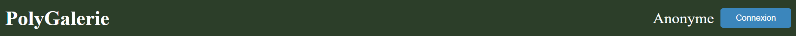

# TP3 PolyGalerie

## Mise en contexte et objectifs du travail pratique

Ce travail pratique vise à vous familiariser avec Node.js, Express, et les principes des communications HTTP via la création d'un site web interactif et un serveur dynamique.

Votre objectif principal est de développer un système de galerie d'images avec des comptes utilisateur. Le système sera composé d'un serveur dynamique interactif utilisant Node.js et Express ainsi qu'un simple site web jouant le rôle d'interface graphique.

Un système d'authentification sera mis en place pour que les utilisateurs puissent se créer un compte et s'y connecter. Certaines actions dans le site web seront restreintes aux utilisateurs connectés.

Les données seront sauvegardées dans de simples fichiers JSON ([images.json](./server/data/images.json) et [users.json](./server/data/users.json)), ce qui vous permettra de vous familiariser avec l'accès au système de fichiers à travers le module `fs`. 

Les images seront sauvegardées dans le répertoire [data/images/](./server/data/images/) et les informations associées à chaque image se retrouveront dans `images.json`.

## Installation des librairies nécessaires

Pour installer les dépendances nécessaires, lancez la commande `npm ci` dans le répertoire `site-web` ET le répertoire `server`. Ceci installera toutes les librairies définies dans le fichier `package.json` avec les versions exactes définies dans `package-lock.json`.

## Déploiement local

Vous pouvez faire un déploiement local de votre serveur statique avec l'outil `http-server`. Si vous lancez la commande `npm start` dans le répertoire `site-web`, un serveur HTTP statique sera déployé sur votre machine et votre site sera accessible sur l'adresse `localhost:3000` ou `<votre-adresse-IP>:3000`. La sortie dans le terminal vous donnera l'adresse exacte d'accès.

Vous pouvez faire un déploiement local de votre serveur dynamique utilisant Node.js. Si vous lancez la commande `npm start` dans le répertoire `server`, votre serveur sera déployé sur votre machine et sera accessible sur l'adresse `localhost:5020` ou `<votre-adresse-IP>:5020`.

### Gestion des images et des fichiers JSON par Git

Le répertoire `server/data/images` et les fichiers JSON dans le répertoire `server/data` joueront le rôle de persistance pour ce TP. Tout changement des données sera détecté et géré par Git.

Si vous ne voulez pas "polluer" vos commits, vous pouvez _ignorer_ les changements de ces fichiers avec la commande suivante : `git update-index --skip-worktree ./server/data/*.json && git update-index --skip-worktree ./server/data/images/*` exécutée à partir de la racine du projet. Notez que ceci va arrêter le suivi de toute modification apportée aux fichiers.

Vous pouvez revenir à la configuration initiale avec `git update-index --no-skip-worktree ./server/data/*.json && git update-index --no-skip-worktree ./server/data/images/*`. Attention à ne pas remettre des fichiers JSON invalides lors de la remise finale du TP. 

## Description du travail à compléter

Il est conseillé de lire l'ensemble du travail demandé et d'implémenter les fonctionnalités une à la fois sur le serveur ET le site web. Il est conseillé de commencer par implémenter le système d'authentication et de gestion des utilisateurs (côté serveur et côté site web) avant de passer à la gestion des images.

### Format des données

Consultez les fichiers `users.json` et `images.json` dans le répertoire `data` pour des exemples de la structure des objets à manipuler. Le résultat des manipulations de votre système doit produire des objets ayant la même structure. Le code qui génère des `id` aléatoires pour vos objets vous est fourni.

## Serveur

Vous devez implémenter un serveur responsable de la gestion des requêtes HTTP sur différentes routes. Pour ce faire, vous allez utiliser la librairie Express.js.

Vous devez compléter le fichier [server.js](./server/server.js) pour qu'il puisse correctement traiter des requêtes de sources externes ainsi que répondre à des requêtes sur les 2 préfixes suivants :
- `/api/auth` (gestion de l'authentification)
- `/api/images` (gestion de la galerie)

### Gestion de la logique du serveur

Les fichiers [fileManager.js](./server/managers/fileManager.js), [authManager.js](./server/managers/authManager.js) et [galleryManager.js](./server/managers/galleryManager.js) sont partiellement implémentés pour vous. Ces fichiers sont responsables respectivement de la gestion des fichiers JSON, de l'authentification et de la gestion des images de la galerie. Vous devez utiliser ces fichiers pour compléter le travail demandé. Lisez bien les TODOs fournis pour comprendre ce qui est attendu de vous.

Le fichier [fileManager.js](./server/managers/fileManager.js) est responsable de la gestion des fichiers JSON. Vous devez compléter les deux méthodes marqués par un **TODO**.

### Gestion des requêtes HTTP

La gestion des requêtes doit être implémentée dans des routeurs dédiés attachés à votre serveur dans le fichier `server.js` (Voir les racines à utiliser plus haut). Les routeurs doivent être configurés pour répondre aux requêtes HTTP pour la gestion de l'authentification et de la galerie d'images.

Les routeurs [auth.js](./server/routes/auth.js) et [gallery.js](./server/routes/gallery.js) sont partiellement implémentés pour vous. Vous devez compléter ces fichiers pour qu'ils puissent correctement effectuer les bonnes opérations selon les routes demandées. Lisez bien les TODOs fournis. 

Par défaut, `router.use` est utilisé, mais vous devez remplacer `use` par les méthodes HTTP appropriées pour chaque route. Vous devez choisir les méthodes HTTP et les codes de retour à utiliser. Il est important de porter une attention particulière à la sémantique des requêtes et réponses HTTP.

**Note** : par défaut, les en-têtes non-officielles (comme `X-Auth-Token`) ne sont pas envoyées. Vous devez les exposer à l'aide de l'en-tête `Access-Control-Expose-Headers` pour que les clients puissent y accéder.

On vous demande également d'implémenter la gestion des erreurs : soit du serveur ou des requêtes incomplètes ou mal structurées.

### Gestion des utilisateurs et de l'authentification 

Les fichiers `authManager.js` et `auth.js` sont partiellement implémentés pour vous. Ces fichiers sont responsables de la gestion des utilisateurs et de leur authentification. Vous devez les compléter pour que le système puisse correctement effectuer les opérations suivantes :
- Créer un nouvel utilisateur
- Connecter un utilisateur (*login*)
- Déconnecter un utilisateur (*logoff*)
- Valider un jeton (*token*) d'authentification d'utilisateur (utilisé pour la gestion de la galerie)

#### Authentification et gestion des jetons

L'authentification des utilisateurs se fait à l'aide de jetons d'authentification. Pour ce TP, la librairie [uuid](https://www.npmjs.com/package/uuid), spécifiquement `uuidv4`, est utilisée pour générer des jetons uniques.

Ce jeton est généré lorsqu'un utilisateur se connecte ou créé un compte. L'utilisateur doit fournir un nom et mot de passe pour créer ou accéder à son compte. Vous devez gérer le cas où un utilisateur tente de se connecter avec des informations invalides ou de créer un compte avec un nom d'utilisateur déjà existant.

Une création de compte ou connexion réussie retourne un jeton d'authentification à l'utilisateur à travers l'entête `X-Auth-Token`. Le jeton est également sauvegardé dans les données de l'utilisateur dans `users.json`. Du côté du client, le jeton doit être sauvegardé dans le _Web Storage_ pour être utilisé lors des requêtes futures.

Ce jeton doit être envoyé dans les requêtes HTTP pour valider l'authentification de l'utilisateur pour certaines opérations de la galerie. Le jeton est envoyé dans l'en-tête `Authorization` dans le format `Bearer <token>`. `Bearer` est un des [schemas d'authentification](https://developer.mozilla.org/en-US/docs/Web/HTTP/Authentication#authentication_schemes) utilisé pour les jetons.

Lorsqu'un utilisateur se déconnecte, le jeton est envoyé dans l'en-tête `Authorization`. Si le jeton est associé à un compte existant, il est invalidé en le supprimant des données de l'utilisateur dans `users.json`. Vous devez gérer les cas où un utilisateur tente de se déconnecter avec un jeton invalide ou inexistant.

Vous devez choisir les méthodes HTTP et les codes de retour à utiliser. Une même route peut retourner des codes de retour différents selon le contexte.

### Gestion des images

Les fichiers `galleryManager.js` et `gallery.js` sont partiellement implémentés pour vous. Ces fichiers sont responsables de la gestion des images. Vous devez les compléter pour que le système puisse correctement effectuer les opérations suivantes :
- Récupérer une image spécifique selon son id
- Gérer l'accès aux images privées et publics
- Ajouter une nouvelle image
- Supprimer une image
- Modifier l'état privé/public d'une image

#### Galerie et gestion des images

Chaque image possède un état privé/public : une image est privée si l'attribut `private` existe et sa valeur est `true` (voir le fichier `images.json`). 

Les images privées ne sont visibles que par un utilisateur connecté. Les images publiques sont visibles par tous, même les utilisateurs anonymes. Seulement un utilisateur connecté peut ajouter une nouvelle image, supprimer une image existante ou modifier l'état privé/public d'une image.

Chaque requête envoyée à la galerie doit être accompagnée d'un jeton d'authentification qui doit être valide à l'aide de la fonction `validateToken` de `AuthManager`. La fonction `parseBearerToken` permet de valider que l'en-tête `Authorization` est bien formé et de retourner le jeton. Si le jeton est valide, la requête peut être traitée par le système. Si le jeton est invalide ou inexistant, vous devez retourner un code de retour approprié. 

Il y a une seule exception : si la requête a pour but de récupérer toutes les images de la galerie, elle peut être effectuée par un utilisateur anonyme, mais seulement les images publiques seront retournées. Si cette requête est faite par un utilisateur connecté (jeton valide), toutes les images seront retournées. Cette détection doit modifier l'objet `req` pour indiquer si on retourne seulement les images publiques ou toutes les images.

L'ajout ou suppression d'une image doit modifier le fichier `images.json` et les informations dans `data/images`. Vous devez gérer les cas où un utilisateur tente d'ajouter une image sans avoir envoyé un fichier ou de supprimer une image qui n'existe pas.

### Tests

Veuillez consulter le fichier [TESTS.MD](./TESTS.MD) pour plus d'informations sur les tests du travail. Vous aurez à implémenter les tests unitaires de la classe `AuthRouter`.

## Site web

On vous fournit un site web avec une mise en page (HTML et CSS) déjà en place pour vous. Les fonctionnalités manquantes vont vous permettre d'interagir avec le serveur. Vous devez compléter le code fourni pour effectuer les bonnes requêtes HTTP vers le serveur.

Il est conseillé de commencer par l'implémentation de l'authentification et de la gestion des utilisateurs avant de passer à la gestion des images.

### Gestion des utilisateurs et de l'authentification 

#### Page de connexion

La page `connect.html` est la page à partir de laquelle un utilisateur peut se créer un compte ou se connecter à un compte existant avec un nom d'utilisateur et un mot de passe. Cette page est accessible à travers le bouton `Connexion` dans l'entête de la page principale ou la navigation vers `/connect.html` directement.

Le formulaire de connexion possède une case à cocher. Si la case est cochée, le formulaire doit permettre à l'utilisateur de créer un compte avec un nom d'utilisateur et un mot de passe. Si la case n'est pas cochée, le formulaire doit permettre à l'utilisateur de se connecter avec le nom d'utilisateur et le mot de passe fournis.

Voici le visuel de la page de connexion :

Si la requête de création de compte est réussie, le jeton d'authentification retourné par le serveur doit être sauvegardé pour être utilisé lors des requêtes futures et un message est affiché.

**Rappel** : le jeton doit être envoyé par le serveur dans l'entête `X-Auth-Token`.

Le jeton est valide seulement durant la durée de vie de l'accès au site web. Si l'utilisateur ferme son navigateur, le jeton est perdu et l'utilisateur doit se reconnecter. Le jeton est également retiré si l'utilisateur se déconnecte (voir la section suivante).

Visuel de la page suite à une connexion réussie :

Si l'utilisateur est déjà connecté et essaie d'accéder à la page de connexion, le formulaire doit être remplacé par un message indiquant que l'utilisateur est déjà connecté : 

Lorsqu'un utilisateur essaie de se connecter avec des informations invalides ou de créer un compte avec un nom d'utilisateur déjà utilisé, un message d'erreur doit s'afficher (formulation exacte des messages laissée à votre discrétion) :
- Informations invalides :

- Nom d'utilisateur déjà utilisé :

Le fichier `connect.js` est partiellement implémenté pour vous. Ce fichier est responsable de la gestion de l'affichage de la page de connexion et de l'envoie des requêtes de connexion et de création de compte. Vous devez compléter les sections marquées par les TODOs.

#### Entête de page

Toutes les pages du site comportent une entête (*header*) avec le nom du site (redirection vers la page principale), le nom de l'utilisateur et un bouton pour se connecter/déconnecter.

Lorsqu'il n'y a pas d'utilisateur connecté, le bouton doit afficher `Connexion` et le nom de l'utilisateur est `Anonyme`. Le bouton redirige vers la page de connexion. Lorsqu'un utilisateur est connecté, le bouton doit afficher `Déconnexion` et le nom de l'utilisateur est affiché à côté. Le bouton déconnecte l'utilisateur et l'entête est mis à jour pour afficher `Anonyme`.

**Rappel** : le jeton d'authentification doit être envoyé au serveur dans le bon format et dans l'en-tête `Authorization` pour la déconnexion.

Visuel de l'entête pour utilisateur connecté :

Visuel de l'entête pour utilisateur nonconnecté :

Le fichier `header.js` est partiellement implémenté pour vous. Vous devez implémenter les fonctions marquées par un TODO. Vous devez gérer le cas où le gestion d'authentification a été supprimé du _storage_ et une tentative de déconnexion est faite.

### Page principale

La page principale `index.html` présente les images de la galerie avec un lien vers leur propre page.

Si l'utilisateur n'est pas connecté (utilisateur anonyme), il doit voir dans cette page uniquement les **images publiques** (par défaut, l'image de Plage est *privée*). Un utilisateur connecté quant à lui voit **toutes les images (privées et publiques)**.

Visuel de la page principale pour un utilisateur connecté:

Un formulaire présent au bas de la page permet d'ajouter une image à la galerie. Un utilisateur non-connecté n'est pas autorisé à ajouter des images : une popup d'alerte (*window.alert*) indiquant qu'il n'est pas autorisé a effectuer cette action s'affiche lorsqu'il essaie de soummetre le formulaire.

Message d'erreur lorsqu'un utilisateur anonyme essaie d'ajouter une image :

**Rappel** : le jeton d'authentification doit être envoyé au serveur dans le bon format et dans l'en-tête `Authorization`.

Chaque image de la galerie est un lien vers la page de l'image correspondante (`image.html?id=xyz`). La génération du HTML pour les images vous est fournie, mais vous devez compléter le code pour la récupération de l'image du serveur ainsi que le lien de redirection.

Le fichier `gallery.js` est partiellement implémenté pour vous. Ce fichier est responsable de la récupération des images de la gallerie, de l'ajout d'images et de la gestion de l'affichage de la page principale. Notez que l'utilisation de `innerHTML` dans le code est seulement à des fins de brièveté pour ce travail pratique.

#### Page d'image

La page `image.html?id=xyz` présente les informations sur le l'image ayant l'id `xyz`. La mise en page visuelle de la page vous est fournie.

Visuel de la page pour une image publique:

Il ne doit pas être possible pour un utilisateur anonyme de modifier l'état privé/public d'une image ou de la supprimer. Si un utilisateur anonyme essaie d'effectuer une de ces actions, une popup d'alerte (*window.alert*) est affichée avec un message expliquant qu'il ne peut pas effectuer cette action:

Si une image est privée et que l'utilisateur est anonyme, il ne doit pas être en mesure de voir les informations de l'image. Le titre de l'image est remplacé par un message `Image non trouvée` et une image par défaut est affichée. Le même comportement doit être observé pour une image inexistante.

Visuel pour image introuvable/inexistante (ou pour image existante mais privée et l'utilisateur est anonyme) :

Le fichier `image.js` est partiellement implémenté pour vous. Ce fichier est reponsable de la gestion de l'affichage de la page d'image et de l'envoie des requêtes permettant supprimer une image et de modifier son état privé/public.

**Rappel** : le jeton d'authentification doit être envoyé au serveur dans le bon format et dans l'en-tête `Authorization`.

## Fonctionnalité bonus

Dans la version de base, il n'y a pas de manière de supprimer un compte créé sauf si on ne modifie pas le fichier JSON à la main. Vous devez ajouter une fonctionnalité qui permet à un utilisateur de supprimer son compte à travers la page `connect.html`. Cette fonctionnalité doit être accessible seulement si l'utilisateur est connecté. 

Le serveur doit vérifier que le jeton envoyé par la requête de suppression est valide et correspond à l'utilisateur qui veut supprimer son compte. Si le jeton est invalide ou inexistant, le serveur doit retourner un code de retour approprié. Si le jeton est valide, le compte de l'utilisateur doit être supprimé des données des utilisateurs dans `users.json` et l'utilisateur doit être déconnecté de son compte sur la page web. 

# Correction et remise

La grille de correction détaillée est disponible dans [CORRECTION.MD](./CORRECTION.MD). Le navigateur `Chrome` sera utilisé pour l'évaluation de votre travail. L'ensemble des tests fournis doivent réussir lors de votre remise. Les tests ajoutés par l'équipe doivent aussi réussir.

Le travail doit être remis au plus tard le vendredi 15 novembre 23:59 sur l'entrepôt Git de votre équipe. Le nom de votre entrepôt Git doit avoir le nom suivant : `tp3-matricule1-matricule2` avec les matricules des 2 membres de l’équipe.

**Aucun retard ne sera accepté** pour la remise. En cas de retard, la note sera de 0.