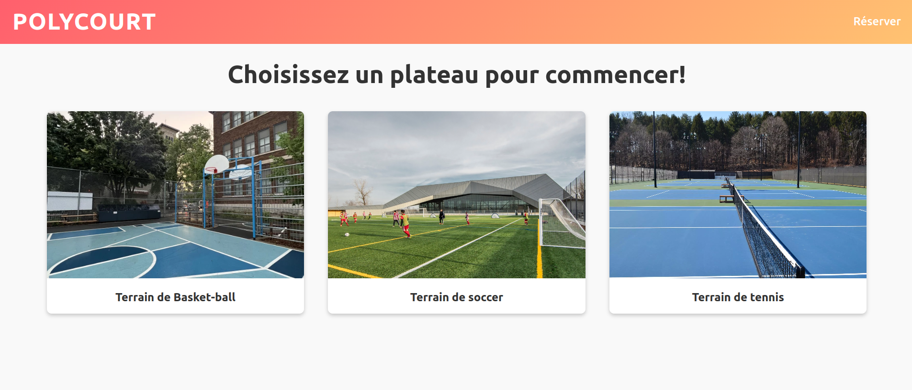
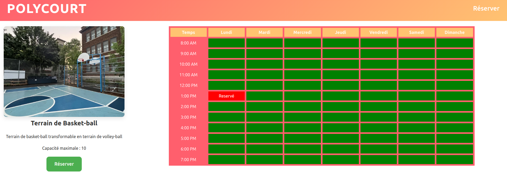
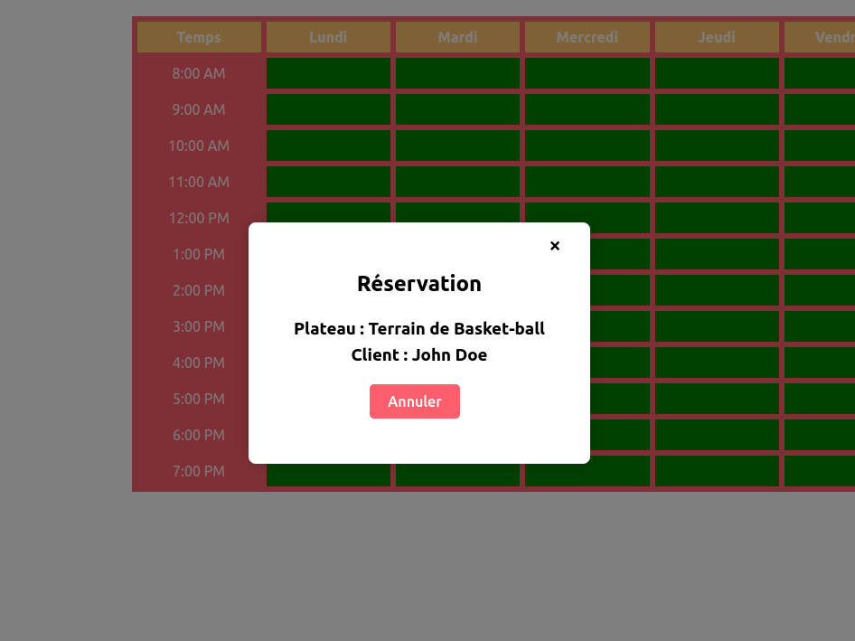
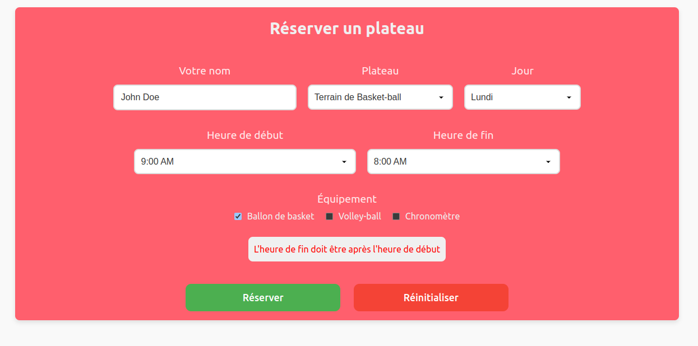
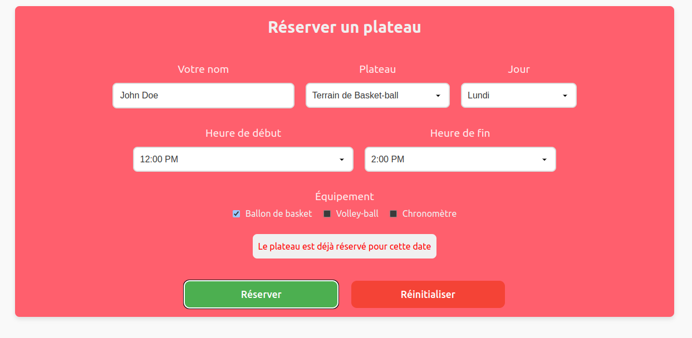
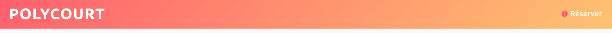

[](https://classroom.github.com/a/Fu_GjJYs)
# TP4 PolyCourt

# Mise en context et objectifs du travail pratique

Le but de ce travail pratique est de vous familiariser avec le développement d'une application web _full stack_ utilisant une base de données pour assurer la persistance des données. Pour ce faire, vous utiliserez la librairie _React_ pour le côté client et vous vous connecterez à une base de données _MongoDB_ à partir d'un environnement _NodeJS_ pour le côté serveur.

L'application à compléter est une preuve de concept d'un système de réservation en ligne qui permet à l'utilisateur de consulter des plateaux sportifs et de les réserver pendant une plage horaire quelconque. Chaque plateau peut être réservé une seule fois par plage horaire et l'utilisateur peut empreunter de l'équipement qui est associé à chaque plateau. Par la suite, l'utilisateur peut consulter les réservations déjà faites et de les annuler. L'application est déjà partiellement développée et vous devez compléter les fonctionnalités manquantes.

Le code source fourni contient deux applications distinctes, soit une application ReactJS (répertoire `site-web`) ainsi qu'une application NodeJS/Express (répertoire `server`). L'application React est constituée de composantes qui se retrouvent dans les répertoires `components` et `pages`.

Le serveur, pour sa part, comprend un routeur, des services et des données par défaut. C'est le fichier `server.js` qui sera exécuté au lancement du serveur.

## Configuration de la base de données

Vous devez configurer une instance MongoDB pour la persistance de vos données. Vous devez utiliser le service [Cloud Atlas](https://www.mongodb.com/cloud/atlas).

**Vous devez configurer votre instance avant de pouvoir effectuer le travail demandé**. Un guide pour la configuration d'instances MongoDB avec Cloud Atlas est disponible sur le projet [GitHub du cours](https://github.com/LOG2440/Cours-11-MongoDB/blob/master/README.MD) de l'exemple sur MongoDB présenté en classe.

Le fichier [env.js](./server/utils/env.js) contient les constantes avec les informations de connexion à votre instance MongoDB. Vous devez les remplacer avec les bonnes valeurs de votre propre instance. 
**Important** : Assurez-vous de remettre le fichier `env.js` avec les bonnes valeurs avant de remettre votre travail.

## Installation des librairies nécessaires

Pour installer les dépendances nécessaires, lancez la commande `npm ci` dans la racine de chaque application (et donc deux fois au total). Ceci installera toutes les librairies définies dans le fichier `package-lock.json`.

## Déploiement local

Lors du développement, vous pouvez faire un déploiement local d'un serveur statique qui servira votre site web et de votre serveur dynamique avec la commande `npm start`. Notez bien qu'il faut exécuter la commande à la racine de chaque application (dans `/site-web` et `/server`) dans deux consoles distinctes afin que les deux fonctionnent en parallèle.

Le serveur statique sera déployé à l'adresse `localhost:3000` (ou `<votre-adresse IP>:3000`). Le serveur dynamique sera déployé à l'adresse `localhost:5020` et commencera à écouter le port 5020.

# Description du travail à compléter

Il est conseillé de lire l'ensemble du travail demandé et d'implémenter les fonctionnalités côté serveur en premier avant de vous attaquer au site web. Un ensemble de tests vous est fourni pour valider le bon fonctionnement de votre serveur. Pour plus d'informations, consultez le fichier [TESTS.MD](TESTS.MD).

## Format des données et les données initiales

Consultez les fichiers [items.json](./server/data/items.json) et [plateaus.json](./server/data/plateaus.json) pour voir les données initiales à utiliser. À des fin de simpicité, les items et plateaux par défaut ne sont pas modifiables par l'application.

Un équipement (item) a un identifiant unique, un nom et une catégorie : 
```json
{
  "id": "1",
  "name": "Ballon de basket",
  "category": "Basketball"
}
```

Un plateau a un nom, une description, une capacité maximale et des items qui sont permis d'être empruntés lors d'une réservation : 
```json
{
  "id": "p1",
  "name": "Terrain de Basket-ball",
  "description": "Terrain de basket-ball transformable en terrain de volley-ball",
  "maxCapacity": 10,
  "allowedItems": [ "1","4","5"]
}
```

Les réservations seront générées par votre système et leur format est le suivant :
```json
{
    "plateauId": "p1",
    "plateauName": "Terrain de Basket-ball",
    "clientName": "John Doe",
    "startTime": "2024-12-02T12:00:00Z",
    "endTime": "2024-12-02T13:00:00Z",
    "createdAt": "2024-12-02T11:00:00Z",
    "itemIds": ["1"]
}
```
Notez que les dates sont en format ISO 8601. Lors du transfert des données, les dates seront en format `number` (timestamp Unix). Une réservation peut avoir aucun ou plusieurs items associés.

# Serveur dynamique

Vous devez établir la communication avec une base de données MongoDB à partir de votre serveur dynamique. Pour ce TP, on vous demande de placer les différentes données dans 2 collections séparées nommées `ITEMS` et `PLATEAUS` (Voir le fichier [env.js](./server/utils/env.js) pour les noms des collections).

Lors du lancement du serveur dans `server.js`, celui-ci se connecte à la base de données et ajoute les données initiales dans les collections d'items et plateaus, seulement si la collection est vide. Initialement, il n'y a aucune réservation dans le système. Ceci vous permettra d'avoir des données initiales avec lesquelles tester votre système.

Vous devez implémenter les fonctionnalités présentes dans les classes [ReservationService](./server/services/reservation.service.js) et [DatabaseService](./server/services/database.service.js) qui représentent les services principaux dans votre système. 

Le routeur [Reservation](./server/routes/reservations.js) est implémenté pour vous, mais fera appel aux fonctions que vous aurez à implémenter. Vous pouvez utiliser son code pour comprendre comment les fonctions que vous implémenterez seront appelées. Vous devez compléter la configuration du serveur dans [server.js](./server/server.js) pour que la base de donnée soit peuplée avec les données initiales au premier lancement du serveur.

Chaque fonction à implémenter contient le mot clé TODO dans son en-tête. Les fonctions à compléter retournent des valeurs par défaut afin de permettre l’exécution du code, mais vous devez modifier ces valeurs de retour.

## DatabaseService

Vous devez implémenter la fonction `populateDb` qui remplit une collection avec des données seulement si la collection est vide. Cette fonction est exécutée lors du lancement du serveur et remplit la BD avec les valeurs du fichier JSON du répertoire `data` du projet. Si la collection de la BD contient déjà des valeurs, aucune modification ne devra avoir lieu.

## ReservationService

Cette classe contient l'ensemble des fonctions qui permettent de manipuler les données sur la base de données. Notez que seulement les réservations peuvent être créées et supprimées. Les items et plateaux ne peuvent pas être modifiés et sont accédés en lecture seule.

Vous devez implémenter les différentes fonctions marquées avec un `TODO`. Notez que dans le cas de la fonction `createReservation`, la gestion des problèmes : plateau fourni invalide, items invalides ou plage horaire déjà réservée sont gérées par des exceptions. Vous devez donc les lancer dans le cas où un problème survient.

## Réinitialisation de la base de données

Une route spéciale `DELETE /reservations/reset` vous permet de réinitialiser la base de données. Cette route et sa logique sont déjà implémentées pour vous et vous pouvez l'utiliser pour réinitialiser la base de données pendant le développement.

# Site web

Un style CSS vous est fourni dans le cadre du TP. Vous pouvez modifier le style global ou spécifique d'une composante si vous le désirez en autant que les fonctionnalités du travail ne sont pas affectées négativement.

## Accès au serveur

L'accès au serveur se fait à travers un _hook_ personnalisé implémenté dans [useReservationSystem](./site-web/src/hooks/useReservationSystem.jsx). Ce _hook_ est partiellement implémenté pour vous, mais vous devez le compléter pour qu'il puisse communiquer avec le serveur. Le _hook_ utilise les _hooks_ de base de React `useState` et `useEffect`. Vous devez passer par ce _hook_ pour l'ensemble des interactions avec le serveur.

## Composantes de pages

Le site web de l'application permet de visualiser les données du système et de faire des réservations. Le site est divisé en 3 pages principales : la page d'accueil, la page d'informations d'un plateau et le formulaire de réservation. 

### Page d'accueil

La page d'accueil affiche une vignette (composante `Plateau`) de chaque plateau disponible. Vous devez compléter la composante [Home](./site-web/src/pages/home.jsx) pour générer dynamiquement les vignettes à partir des données reçues du serveur et non de manière statique. Notez que l'objet `images` dans [imageSource](./site-web/src/utils/imageSource.jsx) permet de faire le lien entre l'identifiant d'un plateau et son image associée.

Le visuel de la page d'accueil est le suivant :


#### Vignette de plateau

Chaque vignette de plateau doit afficher le nom et l'image du plateau. Vous devez compléter la composante [Plateau](./site-web/src/components/plateau.jsx) pour afficher ces informations. Chaque vignette est cliquable et redirige l'utilisateur vers la page d'informations du plateau.

### Page d'un plateau

Chaque plateau a une page d'informations qui affiche le nom, la description et sa capacité maximale. Vous devez compléter la composante de page [Plateau](./site-web/src/pages/plateau.jsx) pour afficher ces informations. Un bouton permet de naviguer vers la page de réservation avec le nom du plateau pré-rempli.

La page continent un calendrier (composante `Calendar`) qui affiche les réservation déjà faites pour ce plateau. Un clic sur une plage réservée affiche un _popup_ (composante `Popup`). Ces deux composantes ne sont pas en contact direct et doivent passer par leur parent afin de communiquer à l'aide de la fonction `togglePopup`.

Le visuel de la page avec une réservation à 1:00 PM est le suivant :


#### Calendrier

Vous devez compléter la composante [Calendar](./site-web/src/components/calendar.jsx) pour afficher un tableau avec les plages horaires réservés ou non. Ce tableau contient les jours de la semaine en entête et les heures en colonne. À des fins de simplicité, les réservations auront toujours lieu la première semaine de décembre 2024 (du 2 au 7 décembre). Vous trouverez les noms des jours et heures dans le fichier [de constantes](./site-web/src/utils/constants.jsx).

Les plages réservées sont affichées en rouge avec le mot `Réservé` et celles disponibles en vert. Vous devez implémenter la logique pour afficher ce mot pour les plages réservées.

Un clic sur une plage réservée doit afficher un _popup_ avec les informations de la réservation.

#### Popup

Vous devez compléter la composante [Popup](./site-web/src/components/popup.jsx) pour afficher les informations d'une réservation. Cette composante est générique et prend en paramètre un objet `content` qui est une structure HTML à afficher. Cettre structure sera générée par son parent (la page d'un plateau) et passée en paramètre.

La componsante contient un bouton pour fermer le _popup_ en haut à droite et un bouton pour annuler la réservation. Vous devez implémenter la logique de demande d'annulation de réservation.

Le visuel du _popup_ est le suivant :


### Page de réservation

La page de réservation contient un formulaire qui permet à l'utilisateur de réserver un plateau. Vous devez compléter la composante de page [Reservation](./site-web/src/pages/reservation.jsx). La partie visuelle de la composante vous est fournie et vous aidera à compléter la logique de réservation ainsi que mieux comprendre la syntaxe de React.

Il est possible de commencer une demande de réservation et changer de page. L'information doit être conservée et affichée lors du retour à la page de réservation. Pendant ce temps, un indicateur visuel est visible dans l'entête du site. Voir les prochaines sections pour plus d'information. Si la page est accédée à travers l'entête, le formulaire doit être vide ou avec les informations de la réservation en cours d'édition. Si la page est accédée à travers la page d'un plateau, le formulaire doit être pré-rempli avec le nom du plateau.

Tous les champs du formulaire sont obligatoires. Vous devez afficher un message d'erreur si un champ est vide ou si la plage horaire est invalide (heure de fin plus petite ou égale à l'heure de début). Vous devez également afficher un message de succès si la réservation est effectuée avec succès. Seuls les équipements (items) disponibles pour le plateau choisi sont affichés dans le formulaire. Une réservation peut avoir aucun ou plusieurs items associés.

Un bouton permet d'envoyer une demande de réservation : la validation du formulaire se fait au moment de l'envoi. En cas de conflit de réservation (plage déjà réservée) vous devez afficher un message d'erreur.

Un autre bouton permet de réinitialiser le formulaire et d'indiquer qu'aucune réservation n'est en cours.

Voici le visuel de la page en cas d'erreur dans les heures :


Voici le visuel de la page en cas de conflit d'horaire :


#### Gestion d'état de la réservation

Vous allez utiliser le patron [SAM](https://sam.js.org/) et le concept de `Reducer` pour gérer les actions envoyées par les composantes et modifier l'état de votre réservation en cours. Le fichier [reservation-reducer](./site-web/src/reducers/reservation-reducer.jsx) contient le `Reducer` utilisé. Vous aurez à implémenter la logique de gestion de deux actions : la mise à jour de la réservation en cours (durant son édition) et la réinitialisation de la réservation en cours (après l'envoi de la réservation ou à travers le bouton de réinitialisation).

### Entête de pages

Chaque page doit partager le même entête implémenté dans [Header](./site-web/src/components/header.jsx). L'entête contient un lien vers la page d'accueil et un lien vers la page de réservation. Dans ce component, vous devez vérifier si une réservation est en cours et afficher une notification à côté du lien de réservation si c'est le cas (le rendu visuel de la notification est déjà implémenté pour vous) : 



## Fonctionnalité bonus

Dans la version de base de votre projet, il n'y a pas de manière de modifier une réservation déjà existante. Vous devez ajouter un bouton dans le popup de réservation qui redirige l'utilisateur vers la page de réservation avec les informations de la réservation déjà existante. L'utilisateur peut alors modifier une ou plusieurs des informations de la réservation et les sauvegarder. En cas de réservation réussie, la réservation est mise à jour avec les nouvelles informations. 

En cas de modification de la logique de serveur, vous ne devez pas briser le fonctionnement de base demandé dans l'énoncé.

# Correction et remise

La grille de correction détaillée est disponible dans [CORRECTION.MD](./CORRECTION.MD). Le navigateur `Chrome` sera utilisé pour l'évaluation de votre travail. L'ensemble des tests fournis doivent réussir lors de votre remise. Les tests ajoutés par l'équipe doivent aussi réussir.

Le travail doit être remis au plus tard le jeudi 5 décembre à 23:55 sur l'entrepôt Git de votre équipe. Le nom de votre entrepôt Git doit avoir le nom suivant : `tp4-matricule1-matricule2` avec les matricules des 2 membres de l’équipe.

**Aucun retard ne sera accepté** pour la remise. En cas de retard, la note sera de 0.